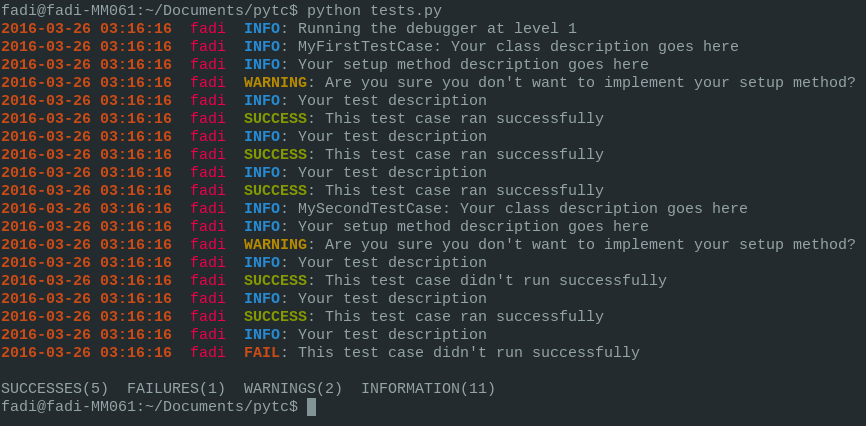

#pytc
<i>pytc</i> (stands for Python Test Case) is a tiny Python code testing tool designed to keep your Python test cases organized and informative.

#What's in the Box?
You basically get two main classes (`TestCase` and `ColorfulOutputLogger`). `TestCase` is the class you'll need to extend in every test case class you write, and `ColorfulOutputLogger` is a debugging mechanism used to log all output in a concise format.

#Installation
```bash
    $ sudo pip install --upgrade git+git://github.com/alkass/pytc
```

#Example
```python
from pytc.testcase import TestCase, run_tests

class MyFirstTestCase(TestCase):
    """
        if the enabled flag is set to False, the whole class gets ignored
        by the run_tests function.
    """
    enabled = True
    description = "Your class description goes here"

    def setup(self):
        # everything you want to run before your test cases execute goes here
        self.warning("Are you sure you don't want to implement your setup method?", 0)
    """
        if the enabled flag is set to False, the specific function gets ignored
        by the run_tests function.
    """
    setup.enabled = True
    setup.description = "Your setup method description goes here"

    def test_1(self):
        #Your third test case
        self.success("This test case ran successfully", 0)
    test_1.enabled = True
    test_1.description = "Your test description"

    def test_2(self):
        #Your third test case
        self.success("This test case ran successfully", 0)
    test_2.enabled = True
    test_2.description = "Your test description"

    def test_3(self):
        #Your third test case
        self.success("This test case ran successfully", 0)
        pass
    test_3.enabled = True
    test_3.description = "Your test description"


class MySecondTestCase(TestCase):
    enabled = True
    description = "Your class description goes here"

    def setup(self):
        # everything you want to run before your test cases execute goes here
        self.warning("Are you sure you don't want to implement your setup method?", 0)
    setup.enabled = True
    setup.description = "Your setup method description goes here"

    def test_1(self):
        #Your first test case
        self.success("This test case didn't run successfully", 0)
    test_1.enabled = True
    test_1.description = "Your test description"

    def test_2(self):
        #Your second test case
        self.success("This test case ran successfully", 0)
    test_2.enabled = True
    test_2.description = "Your test description"

    def test_3(self):
        #Your third test case
        self.fail("This test case didn't run successfully", 0)
        pass
    test_3.enabled = True
    test_3.description = "Your test description"

"""
    TestCase.__subclasses__() provides a list of all classes that extend the
    TestCase class in the order they are seen in your script.
    However, if you'd like to only run specific classes or run all classes in
    a different order, simply provide a python list with the test case classes
    of your choice.
        e.g., classes=[MySecondTestCase, MySecondTestCase]
"""
run_tests(classes=TestCase.__subclasses__(), debug_level=1)
```

And expected output is as follows



#Author

[Fadi Hanna Al-Kass](http://github.com/alkass)
