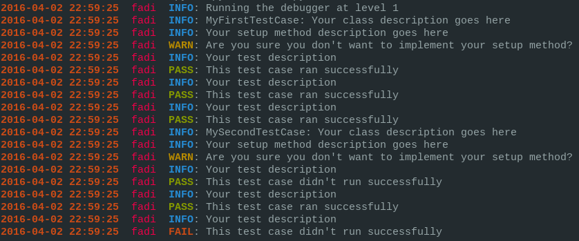

#pytc
<i>pytc</i> (stands for Python Test Case) is a tiny Python code testing tool designed to keep your Python test cases organized and informative.

#What's in the Box?
You basically get two main classes (`TestCase` and `ColorfulOutputLogger`). `TestCase` is the class you'll need to extend in every test case class you write, and `ColorfulOutputLogger` is a debugging mechanism used to log all output in a concise format.

#Installation

1. Clone the repository:

```bash
    git clone https://github.com/alkass/pytc && cd pytc
```

2. Build the module from source:

```python
    sudo python setup.py install
```

#Example
```python
from pytc.testcase import TestCase, run_tests

class MyFirstTestCase(TestCase):
    enabled = True
    description = "Your class description goes here"

    def setup(self):
        # our test cases preperation goes here
        pass
    setup.enabled = True
    setup.description = "Your setup method description goes here"

    def test_1(self):
        #Your test #1 goes here
        pass
    test_1.enabled = True
    test_1.description = "Your test description"

    def test_2(self):
        #Your test #2 goes here
        pass
    test_2.enabled = True
    test_2.description = "Your test description"

    def test_3(self):
        #Your test #3 goes here
        pass
    test_3.enabled = True
    test_3.description = "Your test description"


class MySecondTestCase(TestCase):
    enabled = True
    description = "Your class description goes here"

    def setup(self):
        # our test cases preperation goes here
        pass
    setup.enabled = True
    setup.description = "Your setup method description goes here"

    def test_1(self):
        #Your test #1 goes here
        pass
    test_1.enabled = True
    test_1.description = "Your test description"

    def test_2(self):
        #Your test #2 goes here
        pass
    test_2.enabled = True
    test_2.description = "Your test description"

    def test_3(self):
        #Your test #3 goes here
        pass
    test_3.enabled = True
    test_3.description = "Your test description"

run_tests(classes=TestCase.__subclasses__(), debug_level=1)
```

And the expected output is:



#Author
[Fadi Hanna Al-Kass](http://github.com/alkass)
